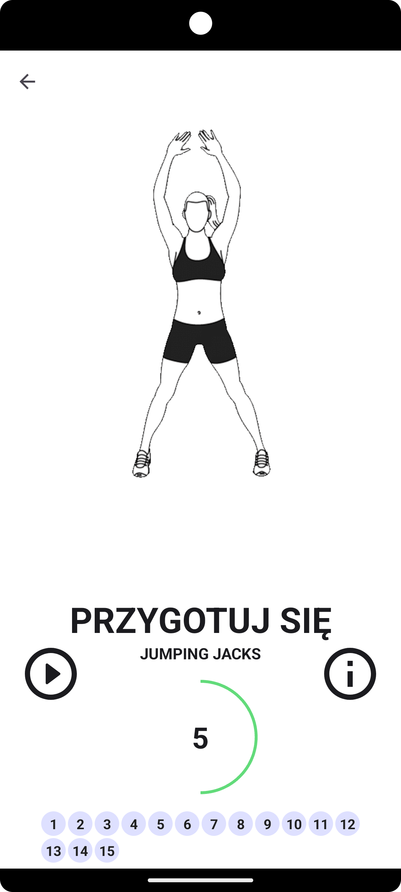

# Projekt zaliczeniowy

Aplikacja Trener Personalny daje użytkownikowi możliwość zrealizowania treningu na każdą partię ciała w dowolnym miejscu i czasie. Z uwagi na jej wielofunkcyjność istnieje możliwość dostosowania przerw między ćwiczeniami, co jest ważne na początku przygody z treningami. Możemy również na bieżąco śledzić nasze postępy, dzięki sekcji z podsumowaniem. Dodatkowo funkcja zmiany języka oraz motywu aplikacji z pewnością ułatwia jej użytkowanie. Poniżej znajduje się dokładne omówienie najważniejszych funkcjonalności aplikacji.

## Opis funkcjonalności

* **Przeprowadzenie treningu na wybraną partię ciała**

W aplikacji znajduje się 5 planów treningowych na każdą partię ciała. Każdy z nich zawiera listę ćwiczeń do wykonania.
Na poniższych obrazkach, możemy zauważyć interfejs menu głównego z wyborem planów treningowych.

Po wybraniu jednego z planów treningowych zostajemy przeniesieni do ekranu z listą ćwiczeń, zawartych w tym planie.

Po kliknięciu przycisku `ROZPOCZNIJ`, następuje uruchomienie ekranu z wykonywaniem treningu. Jak możemy zaobserwować na
poniższych obrazkach, trening polega na wykonywaniu ćwiczenia ukazanego na GIF-ie przez określoną ilość sekund.
Dodatkowo pomiędzy każdym ćwiczeniem występuje kilkusekundowa przerwa oraz wydawane są głosowe komunikaty, dzięki
wykorzystaniu funkcji `TextToSpeech`.

Warto zaznaczyć, że na powyższych obrazkach znajdują się także dwa przyciski, pierwszy z nich, znajdujący się po lewej
stronie od nazwy ćwiczenia, służy do zatrzymania oraz wznawiania licznika czasu ćwiczenia. Drugi przycisk znajdujący się
po prawej stronie wyświetla słowny opis jak wykonać ćwiczenie. Dodatkowo na samym dole znajduje się pasek progresu
naszego treningu. Każde kółko odpowiada pojedynczemu ćwiczeniu. Zielone wypełnienie koła oznacza wykonane ćwiczenie,
natomiast zielona obwódka aktualnie wykonywane.

* **Podsumowanie treningów**

Funkcjonalność ta pozwala wyświetlić łączną liczbę ukończonych treningów, spalonych kalorii oraz minut spędzonych na
wykonywaniu ćwiczeń. Wymienione dane są pobierane z bazy danych, w której uprzednio zostały zapisane po ukończeniu
dowolnego z wymienionych wcześniej planów treningowych.

* **Obliczenie BMI (wskaźnika masy ciała)**

W sekcji z podsumowaniem znajduje się również kalkulator BMI. Za jego pomocą możemy w prosty sposób obliczyć nasz
wskaźnik masy ciała. Wystarczy kliknąć przycisk `EDYTUJ`, znajdujący się po prawej stronie oraz wpisać swoją wagę w KG i
wzrost w CM. Po kliknięciu przycisku `Zapisz` nasze BMI zostanie obliczone oraz wyświetlone w odpowiednim kolorze po
lewej stronie ekranu. Dodatkowo pod spodem znajduje się wykres kołowy ze skalą BMI, który obrazuje kategorie w
klasyfikacji masy ciała na podstawie BMI. Natomiast pod wykresem możemy znaleźć napis mówiący o tym, jaką kategorię
posiadamy.

* **Ustawienia aplikacji**

Funkcjonalność ta pozwala dostosować kilka podstawowych parametrów aplikacji. Pierwszym z nich jest `Czas rozgrzewki`,
który odpowiada za czas w sekundach pomiędzy każdym ćwiczeniem w danej sekcji treningowej.
Opcja `Brak wygaszania ekranu` odpowiada za wyłączenie gaśnięcia ekranu spowodowanego brakiem interakcji z
urządzeniem. `Zmiana języka aplikacji` pozwala na zmianę wszystkich napisów w aplikacji na ich odpowiedniki w danym
języku. Na ten moment obsługiwane są dwa języki: `Polski` i `Angielski`. Ostatnia opcja `Wyczyść dane aplikacji` pozwala
usunąć wszystkie postępy wyświetlane w sekcji z podsumowaniem.

* **Zmiana języka**

Wspomniana wcześniej opcja zmiany języka aplikacji, pozwala przełączać się pomiędzy Polskimi napisami a ich Angielskimi
odpowiednikami. Zmiana ta dotyczy każdego elementu aplikacji, łącznie z komunikatami głosowymi `TextToSpeech`.

* **Ciemny motyw**

Aplikacja w pełni wspiera ciemny motyw. Aby go uruchomić, należy w ustawieniach swojego urządzenia włączyć opcję tryb
ciemny bądź ciemny motyw. Efekty możemy zaobserwować na poniższych obrazkach.

